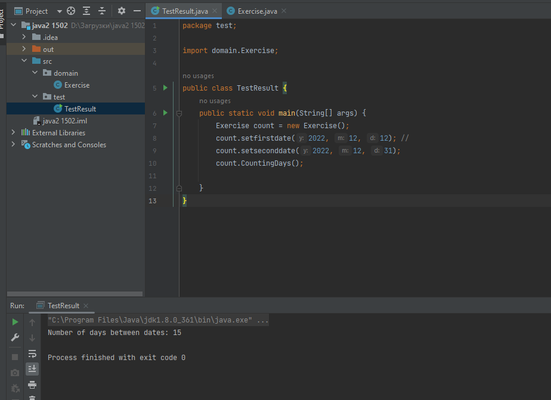

# Практична робота "Створення і використання статичних методів"
## №3. Знайти кількість робочих днів (субота і неділя - вихідні) у проміжку між двома заданими датами
* Код класу Exercise
```java
package domain;

import java.time.DayOfWeek;
import java.time.LocalDate;

public class Exercise {
    /**
     * атрибут типу LocalDate
     */
    private LocalDate firstdate;
    /**
     * атрибут типу LocalDate
     */
    private LocalDate seconddate;
    /**
     * атрибут типу int
     */
    private int count = 0;

    /**
     * Метод для отримання першої дати
     * @param y рік
     * @param m місяць
     * @param d число
     */
    public void setfirstdate(int y, int m, int d) {
        this.firstdate = LocalDate.of(y, m, d);
    }

    /**
     * Метод для отримання другої дати
     * @param y рік
     * @param m місяць
     * @param d число
     */
    public void setseconddate(int y, int m, int d) {
        this.seconddate = LocalDate.of(y, m, d);
    }

   /**
     * Метод для підрахунку та виводу кількості робочих днів
     */
   public void CountingDays() {
        for (LocalDate date = firstdate; date.isBefore(seconddate.plusDays(1)); date = date.plusDays(1)) {
            if (date.getDayOfWeek() != DayOfWeek.SUNDAY && date.getDayOfWeek() != DayOfWeek.SATURDAY) {

                count++;
            }

        }

        System.out.println("Number of days between dates: " + count);
    }

}
```

* Код класу TestResult

```java
package test;

import domain.Exercise;

public class TestResult {
    public static void main(String[] args) {
        Exercise count = new Exercise();
        count.setfirstdate(2022, 12, 12); //
        count.setseconddate(2022, 12, 31);
        count.CountingDays();

    }
}
```
----
## Результат роботи програми

